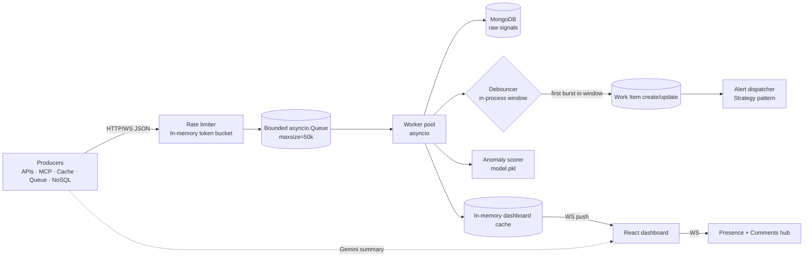
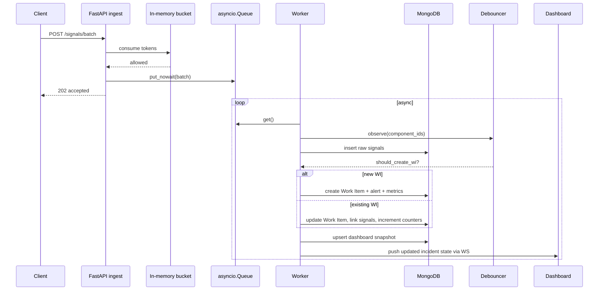
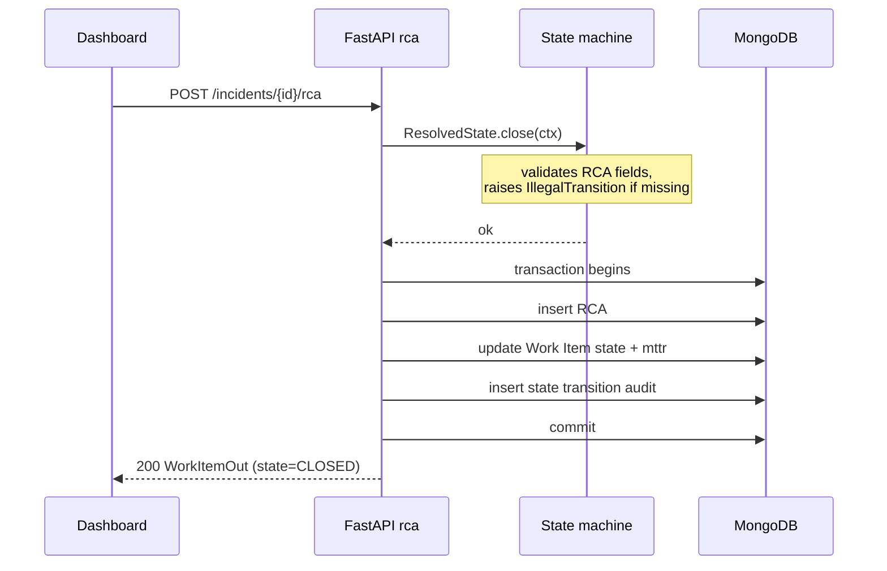

# Architecture

## Implementation overview

This repo implements a MongoDB-first, single-process IMS.
MongoDB acts as the durable store for every persistence concern:

- Data Lake: raw `signals`
- Source of Truth: `work_items`, `rca`, `state_transitions`
- Time-series sink: `signal_metrics`
- Comments + audit: `comments`, `alerts_dispatched`

The hot path is implemented in-process using `asyncio`, which keeps the
single-node Docker Compose setup simple and self-contained. Each in-memory
component includes a documented swap point for Redis/Postgres if the system
is later scaled out.

## High-level data flow

## Component responsibilities

| Component             | File                                           | Role                                                                         |
| --------------------- | ---------------------------------------------- | ---------------------------------------------------------------------------- |
| **Ingest router**     | `backend/app/api/ingest.py`                    | Validates payload; rate-limits; enqueues; returns 202/429                    |
| **Bounded queue**     | `backend/app/ingestion/queue.py`               | Decouples handler from worker; `put_nowait` only                             |
| **Worker pool**       | `backend/app/ingestion/worker.py`              | Drains queue; orchestrates Mongo writes, debouncing, analytics, and alerts   |
| **Debouncer**         | `backend/app/ingestion/debouncer.py`           | In-process window per component; collapses bursty signals into one Work Item |
| **Anomaly scorer**    | `backend/app/ai/anomaly.py`                    | Lazy-loaded `model.pkl`; marks signal outliers                               |
| **Workflow engine**   | `backend/app/workflow/{states,transitions}.py` | State pattern + transition validation                                        |
| **Alert dispatcher**  | `backend/app/workflow/alerting.py`             | Strategy pattern — severity-specific alerting                                |
| **Cache**             | `backend/app/storage/cache.py`                 | In-memory dashboard state + summary cache                                    |
| **Storage**           | `backend/app/storage/mongo.py`                 | MongoDB stores raw signals + Work Items + metrics + comments                 |
| **Gemini summarizer** | `backend/app/ai/gemini_summarizer.py`          | `gemini-2.5-flash-lite` + circuit breaker + TTL cache                        |
| **WS hubs**           | `backend/app/collab/hub.py`, `app/api/ws.py`   | Live feed + per-incident presence/comments                                   |

## Why this stack

- **FastAPI + asyncio** — single language for HTTP, worker pipeline, ML model loading, and WebSockets.
- **MongoDB** for durability across every sink: audit log, incident source of truth, time-series, comments, and alerts.
- **In-process hot path** for rate limiting, debouncing, caching, and presence — ideal for one-node Docker Compose.
- **React + Vite + Tailwind** — fast frontend iteration with responsive incident dashboard and RCA flow.
- **scikit-learn IsolationForest** — lightweight anomaly scoring for raw signal anomalies.
- **Gemini 2.5 Flash Lite** — free-tier AI summaries without blocking the core pipeline.

## Sequence: a signal lands

## Sequence: closing with RCA

